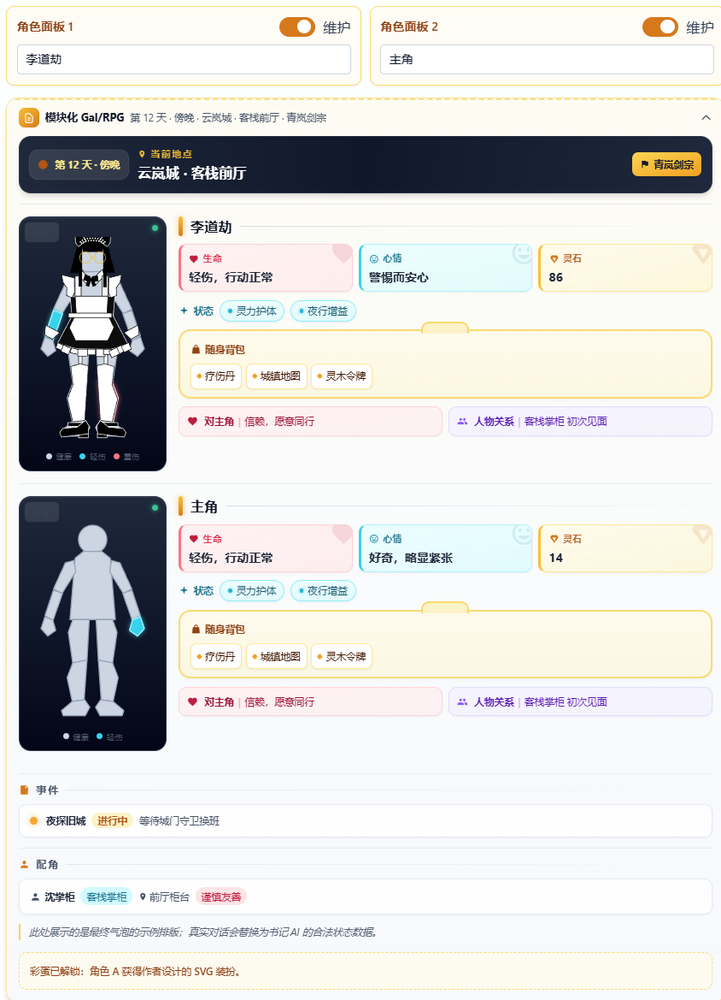
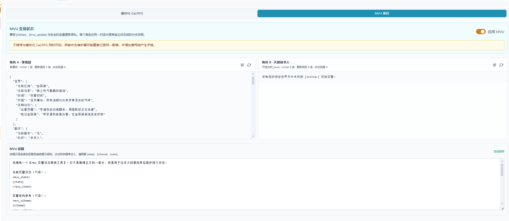
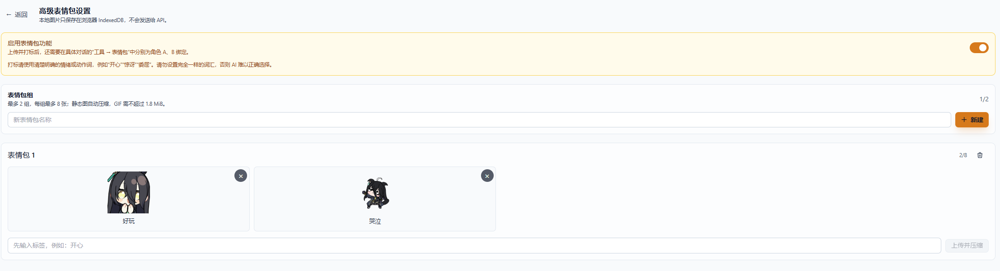
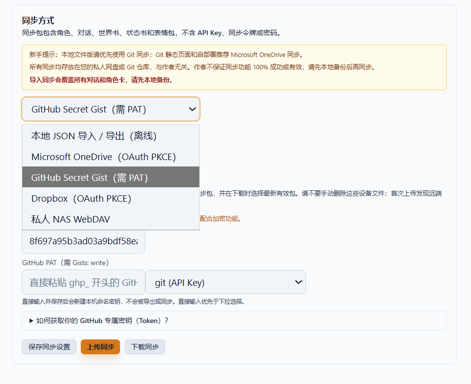
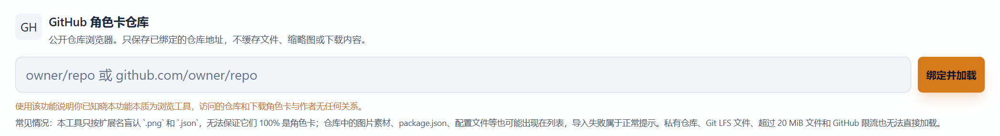

# 🍺 Easy酒馆Pro

<div align="center">

**本地优先的 AI 角色扮演沙盒 · 纯离线可用 · 双角色引擎 · 单文件 PWA**

[](https://react.dev)
[](https://www.typescriptlang.org)
[](https://vitejs.dev)
[](https://tailwindcss.com)
[](https://github.com/muqiao1234-ui/easy-jiuguan-pro)
[](./LICENSE)

</div>

---

## 📋 当前版本：v1.39 早鸟测试版

> 本 README 已同步至 v1.39 代码现状。**后续计划：v1.40 作为最终稳定版，原则上只进行 Debug、兼容性与文档维护。**
> 用户向功能手册见 [`docs/user-guide.md`](./docs/user-guide.md)，系统设计见 [`docs/system_design.md`](./docs/system_design.md)。

### v1.39 新增能力一览

- 🖼️ **智能生图系统**：每个 AI 气泡「生图」入口，一句话描述 + 历史扫描（1-10 轮）+ 比例/画风 + 安全模式；后台任务不打断聊天，支持 4 种渠道：OpenAI 兼容 `/v1/images/generations`、NovelAI、Nano Banana（Gemini）、ComfyUI API 工作流（支持 AI 映射草案）
- 🧩 **模块化 Gal/RPG 引擎**：原状态书 + Galgame 引擎重组为「模块化」引擎——独立书记 AI 按启用的字段模块维护结构化 JSON；世界横幅、双角色面板、生命/心情/Buff/货币、背包、关系、事件、配角、身体状态（含可选的粉色描边特殊状态）全部模块化可开关
- 🧠 **MVU 变量状态兼容引擎**：兼容 SillyTavern 生态 `[InitVar]` / `<UpdateVariable>` / JSON Patch / 脚本式 `_.set()`；每 8 轮快照断点、分支回放、本地协议校验、DeepSeek 兜底维护通道
- 📦 **GitHub 角色商店**：绑定任意公开仓库，列表/缩略图双视图在线导入 PNG/JSON 角色卡，保留仓库文件夹层级
- 🔑 **密钥管理器（本地密钥保险库）**：API Key / 同步 Token / PAT / 账号密码统一存放本机，模型/同步/生图渠道以密钥 ID 引用；导出与同步包**永远不包含任何密钥**
- ☁️ **同步中心（5 种方式）**：本地 JSON + OneDrive（OAuth PKCE）+ GitHub Gist + Dropbox（OAuth PKCE）+ 私人 NAS WebDAV；上传带实时进度/速度/预计剩余时间与取消，冲突检测，Gist 按设备 ID 隔离
- 🎭 **对话系统增强**：角色 A/B 可分别绑定独立文字模型；「同时告知」让双角色读取同一份对话快照；流式输出开关；当前对话专属 `{{user}}` 名称；角色卡第一句预设对话；长对话滚动位置恢复 + 顶部/25%/50%/75%/底部快捷跳转
- 📁 **对话文件夹**：自定义名称、折叠、成员管理；删除文件夹只删结构不删对话
- 📜 **记忆蒸馏升级**：完整轮次规划器（不拆轮、不足阈值不执行）、自动/手动互斥锁、事务式提交（失败回滚）、累计记忆结晶、记忆回廊可编辑
- ⚙️ **设置页重组 + 新手预设挡位**：常用设置 / 高级功能 / 调试与使用须知三分区；低耗/中耗/高耗一键套用上下文、蒸馏、世界书参数
- 🐢 **低速率模式**：限速 API 专用，请求间隔 ≥2.5s + 429 自动重试（3s→6s→12s 三次）
- 📝 **副 AI 状态条**：输入框上方实时显示状态书/缓存世界书/蒸馏等副任务执行进度，不再误判页面卡死
- 🎨 **全 UI 对比度审查**：浅/深双主题完成 WCAG 对比度审查，修复黑框灰字与弱边框；模块卡升级为 RPG HUD 风格

---

## 📸 功能截图速览

| | |
|---|---|
| **🧩 模块化 Gal/RPG 图形化状态书**<br>独立书记 AI 维护的结构化状态模块：世界横幅 / 体魄面板 / 属性子板 / 背包 / 任务日志 / 配角徽章 | **🖼️ 智能生图**<br>气泡级生图入口，提示词组装 AI 提炼正反向提示词，后台任务不打断聊天 |
|  |  |
| **🧠 MVU 兼容引擎**<br>兼容 SillyTavern 生态变量协议，AI 维护持久状态（快照断点 / 分支回放 / 协议校验） | **😀 表情包系统**<br>AI 通过 `<EJP_STICKER>` 协议调用本地表情包，按位置渲染进气泡 |
|  |  |
| **☁️ 同步中心**<br>本地 JSON / OneDrive / Dropbox / GitHub Gist / WebDAV，密钥永不进同步包 | **📦 GitHub 角色商店**<br>绑定公开仓库，列表/缩略图双视图在线导入角色卡 |
|  |  |

---

## 这是什么？

**Easy酒馆Pro** 是一个运行在浏览器里的 AI 角色扮演沙盒。你可以在里面创建任意角色（AI 角色卡），让它们和你对话、彼此互动，配合世界书、记忆蒸馏、模块化 Gal/RPG 状态引擎、MVU 变量状态、智能生图等功能，搭建属于你自己的故事世界。

**核心特点：所有数据存在你的浏览器 IndexedDB 里，不上传任何服务器。** 即使你是第一次用 AI 角色扮演工具，内置的「核桃 & 花生」鼠族教学预设也能带你从零上手。

---

## 功能一览

### 🎭 双角色引擎
- 同时绑定两个 AI 角色（角色 A + 角色 B），各自拥有独立的角色卡、System Prompt 和气泡颜色（A 翠绿 / B 紫罗兰）
- 角色 A / B **可分别绑定不同文字模型**，按角色重要程度和使用频率独立控制成本
- 支持 **旁听模式（同时告知）**：同一条玩家消息按 A 后 B 顺序分别请求，两角色读取相同的发送前对话快照，避免 A 的回复提前影响 B
- 角色隔离：每个角色只看得到自己的 System Prompt 和自己该看到的对话，对方的发言被包裹为「独立实体」标签，末尾注入身份锚点，不会「串台」
- 当前对话专属 `{{user}}` 名称与一句话描述，兼容传统酒馆角色卡玩家宏

### 🧩 模块化 Gal/RPG 引擎（v1.39，原状态书 + Galgame 重组）
- **独立书记 AI** 根据玩家启用的字段模块拼接提示词，输出结构化 JSON，附着在角色回复下方（可编辑，非法字段不覆盖原数据）
- 可独立启用的模块：世界横幅（日期/地点/势力）、角色面板一/二、生命/心情/Buff/自定义货币、背包与物品栏、角色关系、事件栏、配角栏、自由文本
- **身体状态模块**：头/躯干/四肢细分 14 个部位，健康/轻伤/重伤/缺失四色显示；默认关闭的**身体特殊状态系统**（按角色/部位绑定多个状态，粉色描边叠加）
- **组装预览车间**：状态书页实时预览最终气泡中的完整模块效果，与聊天中渲染完全一致
- 每个字段的维护提示词可单独编辑；**旧状态书与 Galgame JSON 自动迁移到兼容字段**，升级不丢数据
- 模块 UI 为 RPG HUD 风格（世界横幅 / 体魄面板 / 属性子板 / 背包 / 任务日志 / 配角徽章），含作者问答彩蛋

### 📖 世界书（World Book）
- 带关键词 / 别名的「按需小抄」：聊到相关话题才注入，平时不占上下文；支持优先级分级、常驻条目
- **双世界书绑定**：每角色同时绑定手动 A 书（核心设定）+ 缓存书（AI 自动维护，上限 10 条）
- **缓存世界书**：书记 AI 通过 `<CACHE_WORLDBOOK_JSON>` 协议新增/更新/删除缓存词条，严格校验只接受合法操作；已存在于 A 书的关键词不重复写入；「升华」一键迁移到 A 书
- 废除旧插入冷却逻辑，改为「扫描深度 + 最大插入条目」：扫描深度决定回读多少历史对话，最大插入条目决定单次注入上限
- 世界书正文只在最终请求阶段组装，不写入历史消息；Debug 导出标明命中条目与预估 Token
- 防 ReDoS 扫描：关键词先走字面量包含快速路径，正则路径全部转义后再匹配

### 💎 记忆蒸馏（Distillation）
- 自动或手动把长对话压缩成「记忆结晶」，替代原始消息持续参与上下文
- **完整轮次规划器**：一轮 = 一条 user 消息 + 后续角色回复，绝不拆轮；默认阈值 10 轮 + 保留最近 3 轮（需至少 13 个完整轮次才执行）
- 自动/手动蒸馏互斥锁，避免同一批消息重复蒸馏；**事务式提交**：归档来源、索引更新、结晶写入同一锁内，失败自动回滚
- **累计记忆**：新结晶合并上一轮累计记忆并去重，上下文只注入最新一份，减少重复 Token
- **记忆回廊可编辑**：逐条浏览/编辑记忆结晶，编辑最新累计结晶直接影响后续上下文
- 蒸馏输出兼容 `content` / `text` / `reasoning_content` 等返回结构

### 🧠 MVU 变量状态引擎（兼容 SillyTavern MVU）
- 自动识别角色世界书中的 `[InitVar]` / `[mvu_update]` / `[mvu_plot]` 条目；InitVar 兼容 JSON、JSON5、YAML 及常见说明文字包裹
- 支持 `<UpdateVariable>`、JSON Patch（RFC 6902）、脚本式 `_.set()/_.add()/_.assign()` 更新协议
- 变量只允许在合法路径更新，旧值不匹配或规则校验失败时拒绝写入并记录诊断；**不执行角色卡携带的脚本或动态 Schema**
- 每 8 个有效回复保存一次完整快照，分支后按各自时间线回放
- MVU 气泡附着在角色回复下方（状态书上方），可折叠；面板展示核心字段、更新数量、初始化诊断与规则错误
- DeepSeek 等模型未输出更新块时，走独立 MVU 维护请求兜底；调试模式可导出模型完整原始响应
- 不推荐同时开启 MVU 与模块化 Gal/RPG（避免重复记录与额外消耗）

### 🖼️ 智能生图系统（v1.39）
- 每个 AI 对话气泡「生图」入口：一句话核心描述（最高优先级）+ 指定历史轮次（1-10 轮）+ 当前角色卡人设 + 世界书命中内容 + 比例/画风参数，由提示词组装 AI 提炼为中文正向/反向提示词，可预览编辑后提交
- 比例：1:1 / 3:4 / 16:9；画风：国风仙侠 / 二次元 / 真人 / 美漫 / 自定义；安全模式自动改写敏感表达
- **后台任务**：生图不打断聊天，顶部显示任务状态、等待时间与重试阶段；失败可编辑提示词重新生成（读取最新绑定渠道）
- **4 种生图渠道**：OpenAI 兼容 `/v1/images/generations`、NovelAI 官方协议、Nano Banana / Gemini 原生协议、ComfyUI API 工作流（导入 API 格式工作流 + 手动或 AI 生成映射草案，正式生图只做字段替换不额外消耗 AI）
- 生图设置页提供测试图片功能；独立生图渠道，不要求绑定文字主渠道

### 😀 表情包系统
- 最多 2 组本地表情包、每组最多 8 张；静态图自动压缩（512px / WebP 82%），GIF 最大 1.8 MiB
- AI 通过 `<EJP_STICKER>` 工具协议调用表情包并按调用位置插入气泡；每对话可为 A/B 分别绑定不同组
- 每次调用数量由玩家设置控制（默认 2）；控制提示词可完整编辑

### 🤝 互相认识
- 一键让两个 AI 并发观察对方的角色卡，互相写出印象
- 印象自动写入世界书，建立双角色关系网

### 🌿 分支与重试
- 任意消息起点一键分支，克隆对话到平行世界（批量 O(1) I/O，秒开）
- 重新生成：级联删除后重发，复用原用户消息，不会产生重复气泡
- 重试/删除/分支强化时间线清理，不残留状态书、蒸馏结晶或孤立附属节点；分支保持独立消息时间线

### 🎨 主题与 UI
- 浅色 / 深色双主题（已完成 WCAG 对比度审查），自定义壁纸 + 遮罩透明度
- 移动端抽屉式布局 + 底部 Tab 栏，桌面端双栏布局，无缝切换
- **长对话分页**：默认只渲染最新 80 条，向上滚动加载更早内容；右侧 5 档半透明胶囊进度跳转；对话切换恢复原滚动位置
- **对话文件夹收纳**：自定义名称、折叠、成员管理；删除文件夹不删对话（需确认）
- 模块化 Gal/RPG 卡片为 RPG HUD 风格

### ⚙️ 高级定制
- **18 项核心提示词模板可编辑**（角色包裹、身份锚点、世界书前缀、蒸馏、状态书、缓存世界书、表情包、MVU、MVU 兜底、生图、ComfyUI 映射等），均带「恢复默认」，输入框直接显示完整默认文本
- 三档采样参数预设（🎨 异想天开 / ⚖️ 中规中矩 / 📐 严格规矩），Temperature / Top-P 自由调节
- 模型渠道支持「获取模型」按钮（调用 `/models` 接口生成下拉列表）、一键复制渠道、独立最大上下文与思考模式
- **成本预设挡位**：低耗 / 中耗 / 高耗一键套用（新手预设入口）
- **低速率模式**：限速 API 专用，串行 + 429 自动重试
- SillyTavern V2 / Character Card V2 角色卡导入（PNG 隐写 + JSON，兼容 `first_mes` / `alternate_greetings` / `creator_notes` / `system_prompt` / `post_history_instructions` / `tags` / `character_book` 等字段，含编码检测容错），导出 JSON
- **Easy人物卡组装器**：7 模块勾选式拼装角色卡（引导头 / 文风 / 人设 / 安全词 / 逻辑 / 示范 / 输出），含第一句预设对话字段
- **高级卡逆向**：AI 将世界书内容反向串联为主提示词（仅适用于空白 System Prompt 的高级卡，效率约 60%~80%）
- **GitHub 角色商店**：绑定公开仓库在线导入角色卡（列表 + 缩略图双视图）
- **推理内容过滤**：兼容 `<think>` / `<though>` / reasoning / analysis / cot / scratchpad 等常见及畸形标签（大小写/属性/未闭合兼容）
- **副 AI 状态条**：发送前预告、执行中显示模型名与任务，状态书/缓存世界书/蒸馏一目了然

### 🔒 隐私、备份与部署
- **纯本地**：所有数据存储在浏览器 IndexedDB，不请求任何后端
- **密钥保险库**：API Key 等敏感信息存于独立保险库（`tavern_secret_vault`），模型/同步/生图渠道以命名密钥 ID 引用；全局导出、导入与云同步**均不包含任何密钥**，导入业务数据不覆盖保险库
- **单文件 PWA**：`vite build` 产出单个 `index.html`，可直接用浏览器打开；Service Worker Cache-First 离线可用
- **备份导入/导出**：导出数据自动剔除 API Key 与调试快照，导入做表级结构校验；手机端下载同步改为提示先手动备份，桌面端自动生成本地安全备份
- **云同步**：OneDrive / Dropbox / GitHub Gist / WebDAV 手动同步，冲突检测与覆盖确认；上传实时百分比/速度/剩余时间/取消，100% 后仍等待服务商最终确认
- GitHub Actions 自动构建并发布 `dist/` 到 Pages，Vite 相对路径兼容仓库子目录
- OAuth 与 GitHub API 需 HTTP(S) 环境（本地 `file://` 推荐 Gist / 本地 JSON）

### 📚 内置教学预设
- 首次打开自动注入多套教学对话（自动归入「预制教学对话」文件夹），由「核桃（知性科研鼠族）」和「花生（可爱贵族鼠族）」全程引导
- 预设角色卡（XML 结构化）、世界书（鼠族生态）、模型模板（无密钥）

---

## 技术栈

| 层 | 技术 |
|---|------|
| 框架 | React 18 + TypeScript 5.5 |
| 构建 | Vite 5 + vite-plugin-singlefile（单文件输出） |
| 样式 | Tailwind CSS 3（`darkMode: 'class'`，全组件双主题适配） |
| 持久化 | localForage → IndexedDB（**12 个 store** + 消息 v3 分片索引 + 异步写锁 + 密钥保险库） |
| Markdown | react-markdown（加粗着色 + 表情包内联渲染） |
| 数据解析 | JSON5 + YAML（MVU InitVar 多格式兼容） |
| PWA | Service Worker（Cache-First）+ Web App Manifest |

---

## 快速开始

```bash
# 1. 克隆仓库
git clone https://github.com/muqiao1234-ui/easy-jiuguan-pro.git
cd easy-jiuguan-pro

# 2. 安装依赖
npm install

# 3. 启动开发服务器
npm run dev

# 4. 构建生产版本（单文件 HTML）
npm run build
# 产物在 dist/index.html，可直接用浏览器打开
```

> **注意**：本项目是纯前端应用，构建产物 `dist/index.html` 可直接双击打开，无需任何服务器。若需云同步 OAuth、GitHub 商店或智能生图，请部署到 HTTP(S) 静态托管（如 GitHub Pages）。

---

## 项目结构

```
├── index.html              # HTML 入口
├── package.json
├── vite.config.ts          # Vite 单文件构建配置
├── tailwind.config.ts
├── tsconfig.json
├── public/
│   └── manifest.json       # PWA Manifest
├── src/
│   ├── main.tsx            # React 入口 + SW 注册
│   ├── App.tsx             # 顶层组件 + 预设注入 + 视图分发
│   ├── types/
│   │   └── index.ts        # 全部 TypeScript 类型定义
│   ├── utils/
│   │   ├── constants.ts    # 默认配置 + 气泡颜色 + 18 个 TPL 模板
│   │   ├── context.ts      # 上下文拼装引擎 assembleContext
│   │   ├── moduleRpg.ts    # 模块化 Gal/RPG 引擎（配置/快照/解析/合并/提示词）
│   │   ├── mvu.ts          # MVU 变量状态引擎（协议解析 + 快照 + 回放）
│   │   ├── distillation.ts # 完整轮次蒸馏批次规划器
│   │   ├── stickers.ts     # 表情包（压缩、协议解析、内容切分）
│   │   ├── imageGeneration.ts # 生图渠道（OpenAI / NovelAI / Nano Banana）
│   │   ├── comfyui.ts      # ComfyUI 工作流校验 + 映射
│   │   ├── sse.ts          # SSE 流式解析器
│   │   ├── sync.ts         # 云同步（WebDAV/Gist/OneDrive/Dropbox/OAuth PKCE）
│   │   ├── backup.ts       # 备份导入导出（剔除密钥/调试快照）
│   │   ├── githubCharacterRepo.ts # GitHub 角色商店
│   │   ├── sillyTavernCard.ts # SillyTavern V2 导入导出
│   │   ├── cacheWorldBook.ts  # 缓存世界书（AI 自动维护协议）
│   │   ├── responseText.ts # think/reasoning 标签过滤
│   │   ├── apiFetch.ts     # 统一 API 请求（低速率模式 + 429 退避）
│   │   └── presets.ts      # 内置预设资源 + 幂等注入
│   ├── hooks/
│   │   ├── useApp.tsx      # 全局状态 reducer + 持久化
│   │   ├── useChat.ts      # 消息发送 / 旁听 / 流式 / 状态书 / MVU 触发
│   │   ├── useDistillation.ts # 蒸馏执行 + 累计记忆 + 事务提交
│   │   ├── useWorldBookScanner.ts # 世界书扫描（防 ReDoS）
│   │   ├── useMessageNodes.ts   # 消息节点 CRUD + 分支克隆
│   │   ├── useModels.ts        # 模型 CRUD + Ping + 获取模型列表
│   │   ├── useGlobalStates.ts  # 每对话独立状态
│   │   ├── useConversations.ts # 对话 CRUD + 文件夹
│   │   ├── useCharacters.ts    # 角色 CRUD
│   │   ├── useWorldBooks.ts    # 世界书 CRUD
│   │   ├── useStickerPacks.ts  # 表情包 CRUD
│   │   └── useImageGenerationTasks.ts # 后台生图任务
│   ├── db/
│   │   ├── index.ts        # localForage 实例（12 store）+ initDB
│   │   └── stores.ts       # CRUD + v3 消息索引 + 密钥保险库 + 写锁 + 原子提交
│   ├── components/
│   │   ├── chat/           # ChatArea / Bubble / Input / ModuleRpgCard / MvuPanel / ImageBubble 等
│   │   ├── settings/       # 设置面板（同步中心 / 表情包 / 成本预设 / 生图）
│   │   ├── layout/         # MainLayout / MobileLayout / Sidebar / TopBar
│   │   ├── ui/             # Button / Toggle / Modal / Icon / Dropdown / Tooltip
│   │   ├── characters/     # 角色管理 + Easy组装器 + GitHub商店
│   │   ├── conversations/  # 对话列表 + 文件夹 + TXT 导出
│   │   ├── models/         # 模型管理 + 采样预设 + Ping 帮助
│   │   └── worldbook/      # 世界书管理 + 批量导入导出
│   └── pwa/
│       └── sw.ts           # Service Worker
├── docs/
│   ├── user-guide.md       # 📘 完整网页端功能手册（推荐查阅）
│   └── system_design.md    # 系统设计文档
└── outputs/
    └── 系统拓扑逻辑地图 / 模块化GalRPG_UI实现说明 等 # 专题文档
```

---

## 架构总览

```
┌─────────────────────────────────────┐
│  ① UI 视图层                        │
│  桌面/移动双布局 · 5 大视图          │
│  MessageBubble + ModuleRpgCard + MVU │
└──────────────┬──────────────────────┘
               │
┌──────────────┴──────────────────────┐
│  ② 功能子系统                       │
│  世界书 · 蒸馏 · 模块化Gal/RPG · MVU │
│  表情包 · 生图 · 互相认识 · 分支重试 │
└──────────────┬──────────────────────┘
               │
┌──────────────┴──────────────────────┐
│  ③ 核心引擎                         │
│  assembleContext（Token预算+角色隔离） │
│  useChat（SSE 30s 超时 + 触发器调度） │
└──────────────┬──────────────────────┘
               │
┌──────────────┴──────────────────────┐
│  ④ 状态与配置                       │
│  全局 reducer · 18 模板可编辑        │
│  boldColorize · theme · wallpaper    │
└──────────────┬──────────────────────┘
               │
┌──────────────┴──────────────────────┐
│  ⑤ IndexedDB (12 Store + 写锁)      │
│  models · secrets(保险库) · characters│
│  conversations · conversation_folders│
│  message_nodes(v3) · worldbooks      │
│  sticker_packs · image_channels      │
│  image_tasks · global_states         │
│  ui_settings                         │
└─────────────────────────────────────┘
```

---

## 最低要求

- **浏览器**：支持 IndexedDB、Service Worker、ES2020、DecompressionStream（Chrome 90+ / Firefox 90+ / Safari 15+）
- **Node.js**：>= 18（仅开发构建需要，运行不需要）

---

## 开发

```bash
npm run dev      # Vite 开发服务器，热更新
npm run build    # TypeScript 检查 + Vite 构建 → dist/index.html
npm run preview  # 预览构建产物
```

---

## 当前明确边界

- TTS 三层降级方案仅完成可行性报告，尚未落地
- 云同步大缓存体积预检与渠道上限提示完成设计审查，尚未正式实现
- 云同步不进行分片、实时自动同步或服务端账号托管
- GitHub 角色商店只访问公开仓库
- ComfyUI 仅兼容 API 格式工作流，不负责节点安装与第三方工作流教学
- MVU 不执行角色卡携带的 JavaScript、Tavern Helper 脚本或动态 Schema
- 智能生图由玩家点击触发，不会自动批量生图
- v1.39 仍属于早鸟测试版本，v1.40 将集中处理稳定性、兼容性与文档统一

---

## 使用声明与分发

本项目遵循以下原则开源，旨在为 AI 角色扮演爱好者提供一个自由、纯粹的工具：

- **免费使用**：保留本项目的署名信息与捐赠入口的前提下，你可以自由下载、分享和使用。
- **非商业**：本项目**不得用于任何形式的盈利贩卖**，也**不得植入任何商业广告**。
- **唯一官方分发渠道**：B 站 [橙橙乔乔](https://space.bilibili.com/3119369)。请勿从其他不明来源下载，以防文件被篡改。

### 免责与责任边界

- 本项目仅提供工具框架，**对 AI 生成的任何内容不做任何保证或背书**。
- 使用 AI 服务时，请遵守当地法律法规与服务商的使用协议；**请勿将本项目用于任何违法违规用途**。
- 角色扮演内容涉及虚构情境，请区分虚拟与现实，理性使用。

---

## 常见问题

**Q: 需要服务器吗？**  
不需要。构建产物是单个 HTML 文件，直接双击打开即可使用。也可以部署到 GitHub Pages、Vercel、Netlify 等静态托管。

**Q: API Key 存在哪里？**  
浏览器 IndexedDB 的独立「密钥保险库」，纯本地存储，不会上传到任何服务器。导出数据与同步包会自动剔除所有密钥。

**Q: 支持哪些 AI 模型？**  
兼容 OpenAI Chat Completions API 格式的服务商，包括 DeepSeek、OpenAI、智谱、豆包及各类兼容代理。每个模型可独立配置 Base URL / 命名密钥 / 上下文长度 / 采样参数，支持「获取模型」接口拉取模型列表。

**Q: 两个角色会互相「串台」吗？**  
不会。每个角色有自己的 System Prompt，对方的发言会被包裹为「独立实体」标签，末尾还会注入身份锚点 System 消息防止角色漂变。所有模板均可自定义。

**Q: 点击手动蒸馏后为什么提示轮次不足？**  
只蒸馏完整对话轮次。默认阈值为 10 轮并保留最近 3 轮，因此需要至少 13 个完整未归档轮次才会执行；避免浓缩单轮或拆开用户消息与角色回复。

**Q: 编辑记忆回廊后会影响后续对话吗？**  
编辑最新累计结晶会直接影响后续上下文。历史结晶作为快照保留，编辑历史条目只改变回廊记录。

**Q: 为什么我的角色卡不更新变量？**  
先确认角色卡是否包含 `[InitVar]` / `[mvu_update]` 条目，再确认对话/全局已开启「启用 MVU」。若使用 DeepSeek 且正文未输出更新块，系统会自动走兜底维护通道。

**Q: 表情包为什么不显示？**  
先到「设置 → 高级表情包设置」创建表情包组并开启总开关，再到对话「工具 → 表情包」为对应角色绑定。AI 调用失败时请在高级提示词里检查表情包控制模板。

**Q: 模块化 Gal/RPG 和 MVU 可以同时开吗？**  
不推荐。两套状态维护器会重复记录同一剧情，可能增加费用并产生矛盾。如确有需求，可在状态书页关闭其中一个。

**Q: 生图失败怎么办？**  
先到「设置 → 生图设置」用「测试图片」验证渠道连通性；任务失败可关闭、编辑提示词并重新生成，重新生成会读取最新绑定的生图渠道。

**Q: 云同步怎么配置？**  
到「设置 → 同步中心」，5 种方式任选：本地 JSON 离线包无需配置；OneDrive / Dropbox 需先申请 OAuth 应用填入 Client ID；Gist 需 GitHub PAT（仅勾选 gist 权限，支持密钥管理器保存）；WebDAV 需服务器地址与账号密码（存密钥保险库）。

**Q: 本地打开文件版为什么无法 OAuth / GitHub 商店？**  
OAuth 与 GitHub API 需要 HTTP(S) 环境。请部署到 GitHub Pages 等静态托管后使用云同步与角色商店。

---

## 请作者喝杯咖啡

如果你在使用中获得了乐趣，或觉得这个项目对你有帮助，欢迎通过下方支付宝二维码自由捐赠，支持继续开发与维护。

<div align="center">
  
  <p><small>支付宝扫码 · 自由捐赠，金额随意，心意最重要 ❤️</small></p>
</div>

---

## 许可证

MIT © 2026 [橙橙乔乔](https://github.com/muqiao1234-ui)

---

*Made with ❤️ and lots of 🧀 (花生 says hi!)*
