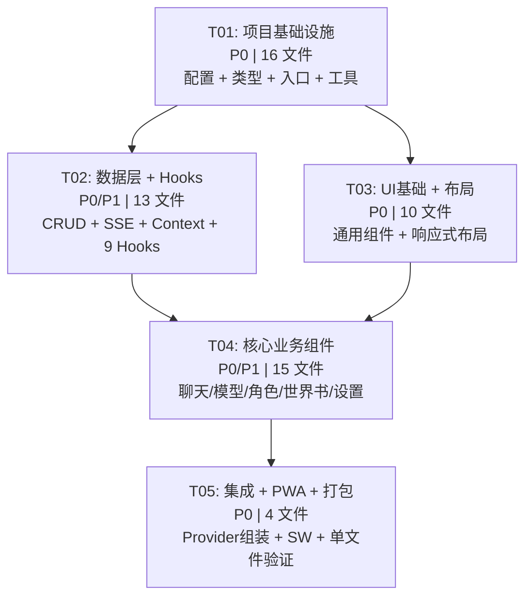

# 🍺 Easy酒馆Pro — 系统架构设计

> Architect: Bob | Date: 2025-06-14

---

## Part A: 系统设计

### 1. 实现方案 + 框架选型

#### 核心技术挑战

| 挑战 | 分析 |
|------|------|
| **单文件打包** | vite-plugin-singlefile 将所有 JS/CSS/资源内联至单个 HTML，需避免运行时 CSS-in-JS 库（增加体积），SVG/图标需内联 |
| **SSE 流式传输** | 使用 fetch + ReadableStream，手动处理 `data: [DONE]` 终止标记和 chunk 截断（跨 chunk 的不完整 UTF-8 字节） |
| **对话树状链表** | message_nodes 使用 parentId/childrenIds 自引用结构，支持分支创建和分支间切换 |
| **记忆蒸馏引擎** | 异步触发蒸馏模型调用，结果写回 message_nodes（role='distilled'），不阻塞主对话流 |
| **世界书扫描** | 每次 Context 组装前扫描最近 M 轮对话，正则匹配 keys，按 priority 排序取 top 3 |
| **响应式双栏布局** | PC 端 280px 侧边栏 + 弹性主区域；移动端单栏 + 底部 Tab 切换 |

#### 框架选型

| 决策点 | 选择 | 理由 |
|--------|------|------|
| **组件库** | **纯 Tailwind CSS** | MUI 运行时 ~200KB+，会显著增大单文件体积；Tailwind 编译时 purging 后仅保留使用到的 CSS（~10KB）；暗色模式用 Tailwind `dark:` 变体原生支持 |
| **状态管理** | **React Context + useReducer** | 单页应用，状态结构清晰（6 个 Store），无需引入 Zustand/Jotai。每个数据域（models/characters/conversations/message_nodes/worldbooks/global_states）独立 Context 提供者 |
| **路由方案** | **无路由库（状态驱动视图切换）** | 侧边栏导航通过 `activeView` state 切换内容面板，无需 URL 路由。若未来需要分享 URL，可扩展 hash-based 路由 |
| **ID 生成** | **crypto.randomUUID()** | 浏览器原生 API，零依赖，生成标准 UUID v4 |
| **图标** | **内联 SVG（Heroicons 风格）** | 避免图标库依赖，手写 ~15 个 SVG 图标内联使用 |

#### 架构模式：分层架构 + 自定义 Hooks

```
┌─────────────────────────────────────────┐
│  Components (UI 层)                      │
│  ChatArea / ModelManager / Sidebar ...  │
├─────────────────────────────────────────┤
│  Hooks (业务逻辑层)                       │
│  useChat / useDistillation / useModels  │
├─────────────────────────────────────────┤
│  DB (持久化层)                            │
│  localForage CRUD wrappers              │
├─────────────────────────────────────────┤
│  Utils (工具层)                           │
│  SSE parser / Context assembler / ID    │
└─────────────────────────────────────────┘
```

---

### 2. 文件列表及相对路径

```
/
├── index.html                          # 入口 HTML（Vite 模板）
├── package.json                        # 依赖声明
├── tsconfig.json                       # TypeScript 配置
├── tsconfig.node.json                  # TS Node 配置（vite.config 用）
├── vite.config.ts                      # Vite 配置 + vite-plugin-singlefile
├── tailwind.config.ts                  # Tailwind 配置（暗色模式 + 自定义 tokens）
├── postcss.config.js                   # PostCSS 配置
│
├── public/
│   └── manifest.json                   # PWA manifest
│
├── src/
│   ├── main.tsx                        # 应用入口，挂载 React
│   ├── App.tsx                         # 根组件，布局壳 + Context Providers
│   │
│   ├── types/
│   │   └── index.ts                    # 所有 TypeScript 类型/接口定义
│   │
│   ├── db/
│   │   ├── index.ts                    # localForage 初始化 + 6 个 store 实例
│   │   └── stores.ts                   # 各 store 的 CRUD 原子操作函数
│   │
│   ├── hooks/
│   │   ├── useModels.ts                # 模型 CRUD + Ping 测试
│   │   ├── useCharacters.ts            # 角色 CRUD
│   │   ├── useConversations.ts         # 对话 CRUD + currentActiveNodeId 管理
│   │   ├── useMessageNodes.ts          # 消息节点 CRUD + 树操作（分支/切换）
│   │   ├── useWorldBooks.ts            # 世界书 CRUD + 条目管理
│   │   ├── useGlobalStates.ts          # 独立状态书 CRUD
│   │   ├── useChat.ts                  # 核心聊天：流式 SSE、Context 组装、发送
│   │   ├── useDistillation.ts          # 蒸馏引擎：触发、异步调用、结果写入
│   │   ├── useWorldBookScanner.ts      # 世界书扫描器
│   │   └── useApp.ts                   # 全局应用状态（activeView, theme, 响应式）
│   │
│   ├── components/
│   │   ├── ui/
│   │   │   ├── Button.tsx              # 通用按钮（variant: primary/secondary/ghost/danger）
│   │   │   ├── Modal.tsx               # 通用模态框（Portal 实现）
│   │   │   ├── Dropdown.tsx            # 下拉选择器
│   │   │   ├── Toggle.tsx              # 开关切换
│   │   │   ├── Icon.tsx                # 内联 SVG 图标集
│   │   │   └── Tooltip.tsx             # 悬浮提示
│   │   │
│   │   ├── layout/
│   │   │   ├── TopBar.tsx              # 顶栏：Logo + 设置/Ping 按钮
│   │   │   ├── Sidebar.tsx             # 左侧边栏：对话列表/世界书/角色/状态书导航
│   │   │   ├── MainLayout.tsx          # PC 双栏布局容器
│   │   │   └── MobileLayout.tsx        # 移动端单栏布局容器
│   │   │
│   │   ├── models/
│   │   │   ├── ModelManager.tsx        # 模型通道列表 + 添加/编辑表单（Modal 内嵌）
│   │   │   └── ModelPing.tsx           # Ping 延迟测试按钮 + 结果显示
│   │   │
│   │   ├── characters/
│   │   │   ├── CharacterManager.tsx    # 角色管理：列表 + 添加/编辑表单
│   │   │   └── CharacterSelector.tsx   # 角色 A/B 下拉选择器（顶部聊天区）
│   │   │
│   │   ├── chat/
│   │   │   ├── ChatArea.tsx            # 聊天主区域容器：消息列表 + 输入框
│   │   │   ├── MessageList.tsx         # 可滚动消息列表（虚拟化或按需渲染）
│   │   │   ├── MessageBubble.tsx       # 消息气泡：区分 user/charA/charB/system/distilled
│   │   │   ├── DistilledBubble.tsx     # 蒸馏消息气泡（含插入/复制按钮）
│   │   │   ├── ChatInput.tsx           # 输入区域：文本框 + 三个发送按钮
│   │   │   ├── BranchTree.tsx          # 分支树可视化面板
│   │   │   ├── StateBook.tsx           # 独立状态书面板（可折叠编辑器）
│   │   │   └── ModelSelector.tsx       # 双模型下拉：聊天模型 + 蒸馏模型
│   │   │
│   │   ├── worldbook/
│   │   │   └── WorldBookManager.tsx    # 世界书管理：列表 + 条目编辑
│   │   │
│   │   ├── conversations/
│   │   │   └── ConversationList.tsx    # 左侧对话列表：新建/切换/删除
│   │   │
│   │   └── settings/
│   │       └── SettingsPanel.tsx       # 设置面板：蒸馏阈值、M/N 参数等
│   │
│   ├── utils/
│   │   ├── id.ts                       # crypto.randomUUID() 封装
│   │   ├── sse.ts                      # SSE chunk 解析器（处理截断、[DONE]）
│   │   ├── context.ts                  # Context 组装算法（固定顺序）
│   │   └── constants.ts               # 默认值常量
│   │
│   ├── styles/
│   │   └── index.css                   # Tailwind directives + 自定义 CSS 变量
│   │
│   └── pwa/
│       └── sw.ts                       # Service Worker 脚本
```

**文件总数：49 个源文件**

---

### 3. 数据结构和接口

> 完整 TypeScript 类型定义存放于 `src/types/index.ts`

```typescript
// ============ 枚举与字面量 ============

type MessageRole = 'user' | 'charA' | 'charB' | 'system' | 'distilled';
type ViewType = 'conversations' | 'worldbook' | 'characters' | 'statebook' | 'settings';

// ============ 核心数据模型 ============

interface ModelConfig {
  id: string;            // UUID
  name: string;          // 显示名称
  baseUrl: string;       // API 地址
  apiKey: string;        // API Key
  defaultModel: string;  // 默认模型名
  latency: number;       // Ping 延迟（ms），-1 表示未测试
}

interface Character {
  id: string;            // UUID
  name: string;          // 角色名称
  avatar: string;        // 头像 SVG 字符串或 data URI
  systemPrompt: string;  // 系统提示词
  worldBookId?: string;  // 关联世界书 ID（可选）
}

interface Conversation {
  id: string;            // UUID
  title: string;         // 对话标题
  currentActiveNodeId: string; // 当前活跃消息节点 ID（分支指针）
}

interface MessageNode {
  id: string;            // UUID
  conversationId: string;
  parentId: string | null;    // null = 根消息
  childrenIds: string[];      // 子分支节点 ID 列表
  role: MessageRole;
  senderName: string;         // 显示名称（用户 / 角色名）
  content: string;
  isArchived: boolean;        // 是否已归档（蒸馏后标记）
  timestamp: number;          // Unix 毫秒
}

interface WorldBookEntry {
  id: string;            // UUID
  keys: string[];        // 触发关键词列表
  value: string;         // 注入内容
  priority: number;      // 优先级（越大越靠前）
}

interface WorldBook {
  id: string;            // UUID
  name: string;          // 世界书名称
  entries: WorldBookEntry[];
}

interface GlobalState {
  conversationId: string;     // 关联对话 ID
  scribeContent: string;      // 独立状态书原始文本
}

// ============ UI 用辅助类型 ============

interface SendTarget {
  type: 'charA' | 'charB' | 'charB_eavesdrop';
}

interface DistillationResult {
  roundStart: number;
  roundEnd: number;
  summary: string;
  nodeId: string;  // 对应 message_nodes 中 role='distilled' 的节点 ID
}

interface DistillationConfig {
  triggerThreshold: number;   // 触发轮数阈值（默认 10）
  concentration: number;      // 蒸馏浓度（1-10，默认 5）
  autoTrigger: boolean;       // 是否自动触发
}

interface ContextAssemblyConfig {
  recentRounds: number;       // M：最近轮数，默认 20
  maxDistilledNodes: number;  // N：蒸馏摘要节点数，默认 5
  maxWorldBookEntries: number; // 世界书条目数上限，固定 3
}

// ============ Context 组装输入/输出 ============

interface AssembledContext {
  messages: Array<{
    role: 'system' | 'user' | 'assistant';
    content: string;
  }>;
  metadata: {
    worldBookMatches: string[];  // 匹配到的世界书条目 ID
    archivedCount: number;       // 本轮归档消息数
    distilledNodesUsed: string[];// 使用的蒸馏节点 ID
  };
}

// ============ SSE 解析用类型 ============

interface SSEChunk {
  content: string;
  done: boolean;
}

// ============ 数据库 Schema ============

interface DBSchema {
  models: ModelConfig[];
  characters: Character[];
  conversations: Conversation[];
  message_nodes: MessageNode[];
  worldbooks: WorldBook[];
  global_states: GlobalState[];
}
```

---

### 4. 程序调用流程

#### 4.1 发送消息到角色 A 的完整流程（含 SSE 流式传输）

> 下方时序图用 Mermaid `sequenceDiagram` 描述。该流程图同时作为独立文件保存至 `docs/sequence-diagram.mermaid`。

#### 4.2 记忆蒸馏触发流程

#### 4.3 世界书扫描流程

---

### 5. 待明确事项（Anything UNCLEAR）

| # | 事项 | 当前假设 |
|---|------|----------|
| 1 | **角色头像存储**：PRD 写 `avatar: string`，是 emoji/URL/SVG？ | 假设为 **emoji 字符串**，简单且零存储开销；后续可扩展为 data URI |
| 2 | **Ping 测试超时**：没有定义超时时间 | 假设 **10 秒超时**，超时后 latency = -2 |
| 3 | **蒸馏触发时机**：自动触发 vs 手动触发？ | 假设 **手动触发为主**（P1-01 可配置自动触发），避免 token 费用意外消耗 |
| 4 | **分支删除**：分支是否可删除？删除后子节点如何处理？ | 假设 **不支持删除分支**，仅支持切换分支；简化实现 |
| 5 | **移动端底部 Tab**：具体 Tab 数量和排列？ | 假设 4 个 Tab：对话 / 世界书 / 角色 / 状态书 |
| 6 | **多对话并行**：是否支持同时打开多个对话 tab？ | 假设 **不支持**，一次只显示一个对话；切换对话时保存当前状态 |
| 7 | **暗色模式切换**：是否提供手动切换？ | 假设 **默认暗色，提供手动切换按钮**（localStorage 记忆偏好） |

---

## Part B: 任务分解

### 6. 依赖包列表

```
- react@^18.3.1: UI 框架
- react-dom@^18.3.1: React DOM 渲染
- localforage@^1.10.0: IndexedDB 封装库
- vite@^5.4.0: 构建工具
- @vitejs/plugin-react@^4.3.0: Vite React 插件
- vite-plugin-singlefile@^2.0.0: 单文件打包插件
- tailwindcss@^3.4.0: 原子化 CSS 框架
- postcss@^8.4.0: CSS 后处理
- autoprefixer@^10.4.0: CSS 自动前缀
- typescript@^5.5.0: 类型系统
- @types/react@^18.3.0: React 类型定义
- @types/react-dom@^18.3.0: ReactDOM 类型定义
```

**零运行时依赖策略**：除 React + localForage 外，不引入任何第三方 UI/状态/工具库，所有功能自行实现以控制单文件体积。

---

### 7. 任务列表

#### ⚠️ 设计原则

- 硬上限 **5 个任务**，每个包含至少 3 个文件
- 按功能层分组：基础设施 → 数据层 → UI 基础 → 业务组件 → 集成打包
- 最大化任务并行度，减少线性依赖链

---

#### T01: 项目基础设施（P0）

**描述**：搭建 Vite + React + Tailwind 项目骨架，定义全部 TypeScript 类型，初始化 localForage 数据库，编写工具函数和常量，配置 PWA manifest 和 Service Worker 占位。

**源文件**（14 个）：
```
index.html
package.json
tsconfig.json
tsconfig.node.json
vite.config.ts
tailwind.config.ts
postcss.config.js
public/manifest.json
src/main.tsx
src/App.tsx
src/styles/index.css
src/types/index.ts
src/utils/id.ts
src/utils/constants.ts
src/pwa/sw.ts
src/db/index.ts
```

**依赖**：无

**优先级**：P0

**产出验证**：`npm run dev` 启动空白页面，Tailwind 暗色背景生效，无 TS 编译错误

---

#### T02: 数据库 CRUD + 工具函数 + 全部 Hooks（P0/P1）

**描述**：实现 localForage 六表 CRUD 操作、SSE 流解析器、Context 组装算法、以及全部 9 个自定义 Hook（覆盖模型/角色/对话/消息/世界书/全局状态/聊天/蒸馏/扫描器/全局应用状态）。

**源文件**（12 个）：
```
src/db/stores.ts
src/utils/sse.ts
src/utils/context.ts
src/hooks/useModels.ts
src/hooks/useCharacters.ts
src/hooks/useConversations.ts
src/hooks/useMessageNodes.ts
src/hooks/useWorldBooks.ts
src/hooks/useGlobalStates.ts
src/hooks/useChat.ts
src/hooks/useDistillation.ts
src/hooks/useWorldBookScanner.ts
src/hooks/useApp.ts
```

**依赖**：T01

**优先级**：P0（useChat/useModels/useCharacters/useConversations/useMessageNodes/useApp）、P1（useDistillation/useWorldBookScanner）

**产出验证**：各 Hook 可独立导入，localForage 读写正常，SSE 解析器通过 mock 流测试

---

#### T03: 通用 UI 组件 + 布局组件（P0）

**描述**：实现通用 UI 组件库（Button/Modal/Dropdown/Toggle/Icon/Tooltip）和响应式布局组件（TopBar/Sidebar/MainLayout/MobileLayout）。所有组件使用 Tailwind CSS 暗色主题。

**源文件**（10 个）：
```
src/components/ui/Button.tsx
src/components/ui/Modal.tsx
src/components/ui/Dropdown.tsx
src/components/ui/Toggle.tsx
src/components/ui/Icon.tsx
src/components/ui/Tooltip.tsx
src/components/layout/TopBar.tsx
src/components/layout/Sidebar.tsx
src/components/layout/MainLayout.tsx
src/components/layout/MobileLayout.tsx
```

**依赖**：T01（需要 types/constants，不依赖 hooks）

**优先级**：P0

**产出验证**：各组件可独立渲染，暗色主题一致，PC 双栏 + 移动单栏布局切换正常

---

#### T04: 核心业务组件（P0/P1）

**描述**：实现所有业务组件：模型管理、Ping 测试、角色管理、角色选择器、聊天区域（消息列表/气泡/输入框/发送按钮）、蒸馏气泡、分支树、状态书面板、模型选择器、世界书管理、对话列表、设置面板。

**源文件**（17 个）：
```
src/components/models/ModelManager.tsx
src/components/models/ModelPing.tsx
src/components/characters/CharacterManager.tsx
src/components/characters/CharacterSelector.tsx
src/components/chat/ChatArea.tsx
src/components/chat/MessageList.tsx
src/components/chat/MessageBubble.tsx
src/components/chat/DistilledBubble.tsx
src/components/chat/ChatInput.tsx
src/components/chat/BranchTree.tsx
src/components/chat/StateBook.tsx
src/components/chat/ModelSelector.tsx
src/components/worldbook/WorldBookManager.tsx
src/components/conversations/ConversationList.tsx
src/components/settings/SettingsPanel.tsx
```

**依赖**：T02、T03

**优先级**：P0（ChatArea/MessageList/MessageBubble/ChatInput/ModelSelector/CharacterSelector/ConversationList/ModelManager/ModelPing/TopBar/Sidebar/MainLayout）、P1（DistilledBubble/BranchTree/WorldBookManager/StateBook/SettingsPanel）

**产出验证**：全部 P0 功能可交互：创建模型→Ping→创建角色→创建对话→发送消息→流式渲染→分支→角色B旁听

---

#### T05: 集成组装 + PWA + 打包优化（P0）

**描述**：在 App.tsx 中集成所有 Context Provider 和布局，注册 Service Worker，配置 vite-plugin-singlefile 打包，验证最终单 HTML 产物功能完整。

**源文件**（修改已有 + 新增）：
```
src/App.tsx（已有，集成 Provider + 路由逻辑 + 响应式检测）
src/main.tsx（已有，注册 SW）
src/pwa/sw.ts（已有，补全 SW 逻辑）
vite.config.ts（已有，确认 singlefile 插件配置）
```

**依赖**：T04

**优先级**：P0

**产出验证**：`npm run build` 生成单个 index.html，双击即可使用，所有 P0 功能正常

---

### 8. 共享知识（跨文件约定）

```
## ID 生成
- 所有实体 ID 使用 crypto.randomUUID()，格式：xxxxxxxx-xxxx-4xxx-yxxx-xxxxxxxxxxxx
- 在 src/utils/id.ts 统一导出 generateId() 函数

## IndexedDB Key 命名
- localForage 实例 key: "tavern_models" | "tavern_characters" | "tavern_conversations" | "tavern_message_nodes" | "tavern_worldbooks" | "tavern_global_states"
- 每个 store 存储整个数组（非逐条存储），读写时整体序列化
- 禁止使用 localStorage，localForage 自动走 IndexedDB

## 暗色模式 Color Tokens（Tailwind 扩展）
- bg-primary: slate-900 (#0f172a)
- bg-secondary: slate-800 (#1e293b)
- bg-tertiary: slate-700 (#334155)
- text-primary: slate-100 (#f1f5f9)
- text-secondary: slate-400 (#94a3b8)
- accent: amber-500 (#f59e0b) — 主强调色（按钮、链接）
- user-bubble: blue-600
- charA-bubble: emerald-700
- charB-bubble: violet-700
- distilled-bubble: amber-800 + dashed border
- system-bubble: slate-600 + italic

## 消息气泡样式区分
- 用户：右对齐，蓝色背景 (blue-600)
- 角色A：左对齐，绿色背景 (emerald-700)，前缀标签 "💬 角色A名"
- 角色B：左对齐，紫色背景 (violet-700)，前缀标签 "💬 角色B名"
- 系统：居中，灰色背景 (slate-600)，斜体
- 蒸馏记忆：带虚线边框 (amber-800 + border-dashed)，前缀标签 "💎 记忆结晶 第X-Y轮"

## Context 组装顺序（固定不可配置）
1. System Prompt（当前目标角色的 systemPrompt）
2. 独立状态书（scribeContent，作为 system 消息）
3. 世界书注入条目（最多 3 条，按 priority DESC 排序）
4. 最近 M 轮未归档消息（按时间顺序）
5. 蒸馏摘要节点（最近 N 条，role='distilled'）

## SSE 流式传输约定
- 请求头: Accept: text/event-stream, Content-Type: application/json
- 响应解析: 按行读取 ReadableStream，前缀 "data: " 提取内容
- 终止标记: "data: [DONE]" 表示流结束
- Chunk 截断处理: 维护未完成行缓冲区，跨 chunk 拼接
- 错误处理: 网络断开显示错误提示，保留已接收内容

## 分支树约定
- 每个 MessageNode 通过 parentId 指向上级，childrenIds 记录分叉
- 分支创建：点击消息气泡「✂️ 分支」→ 复制当前路径的节点链 → 新消息从该节点分叉
- currentActiveNodeId 指向当前活跃叶子节点，所有新消息沿此路径生长
- 切换分支：在 BranchTree 面板点击目标节点 → 更新 currentActiveNodeId

## 蒸馏约定
- 触发：用户点击「蒸馏」按钮或达到阈值自动触发
- 输入：选择最近未蒸馏的 K 轮消息
- 输出：role='distilled' 的虚拟消息节点，content 格式 "📝 记忆 第X轮-第Y轮：{蒸馏文本}"
- 归档：被蒸馏覆盖的消息节点标记 isArchived=true，Context 组装时跳过
- 蒸馏气泡提供三个操作按钮：「插入上下文」「全插入」「复制」
- 导入世界书：用户需手动复制蒸馏文本到世界书管理界面创建条目

## 字符 B 旁听约定
- 手动触发：每次需用户点击「👂 让角色B旁听插话」
- 单次离散：B 生成一条观察反应后停止，不连续参与
- Context 组装：旁听时目标角色为 charB，正常走完整 Context 流程
```

---

### 9. 任务依赖图



**并行策略**：T02 和 T03 可并行开发（均仅依赖 T01），开发完成后汇入 T04。
